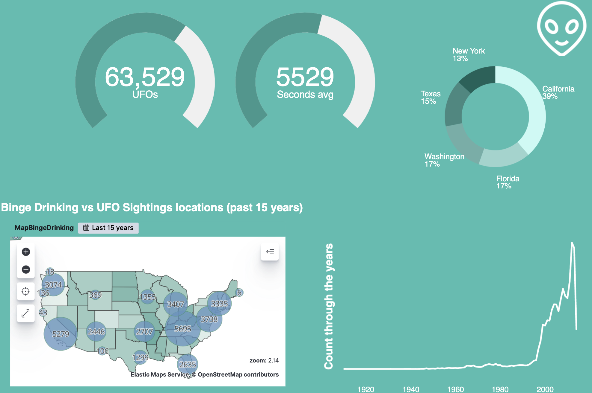

# UFO Sightings data set analysis

Pandas + Canvas Quickie

## Data munging
If you don't have Jupyter, [first install Jupyter](https://jupyter.org/install)

Than start Jupyter
```
jupyter notebook
```

Than go to http://localhost:8888/notebooks/ufoSightings.ipynb

Notebook can also be found [here](ufoSightings.ipynb).

## Canvas
We'll try to build this dashboard in a few minutes... : 



Dashboard export may be found [here](canvasExport.json), good luck :D


